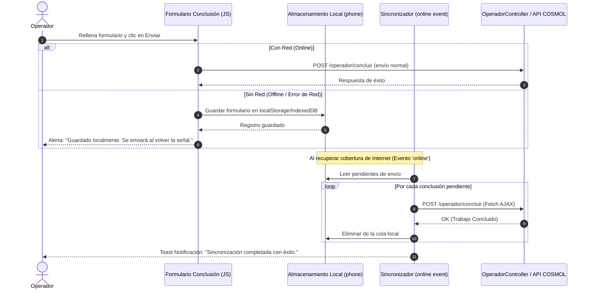

# Plan de Implementación — Módulo de Conclusiones Offline (Sin Señal) para Operadores

Este plan detalla la arquitectura e implementación paso a paso para permitir que los operadores completen y concluyan trabajos de reconexión y reclamo en zonas sin cobertura de red o señal de internet, evitando cualquier pérdida de información y sincronizando automáticamente los datos al restablecer la conexión.

---

## 🔒 Garantía de No-Corrupción y Compatibilidad (Principios Estrictos)
- **Cero cambios destructivos**: No se modifican ni eliminan tablas ni lógica existente de la base de datos local ni de las APIs externas.
- **Mejora progresiva (Progressive Enhancement)**: Si el operador está en línea, el sistema funciona exactamente igual que hoy.
- **Respaldo transparente**: La interceptación offline se activa únicamente cuando `navigator.onLine === false` o cuando la petición HTTP falla por error de red (*fetch/network failure*).
- **PHP 7.3 & Vanilla JS**: Código 100% compatible con la versión del servidor sin introducir frameworks ni dependencias pesadas.

---

## 📐 Arquitectura de la Solución Offline



---

## 🛠️ Cambios Propuestos por Componente

### 1. Cliente JavaScript (`public/assets/js/offline-sync.js`)

#### [NEW] [`offline-sync.js`](file:///c:/Proyectos/Cosmol_reportes/public/assets/js/offline-sync.js)
Creación del gestor offline centralizado `CosmolOfflineSync`:
- **`savePending(data)`**: Almacena en `localStorage` (o `IndexedDB`) la conclusión con su timestamp, ID de trabajo, tipo (`reclamo` o `reconexion`), estado, observacion/glosa, lecturación, y token CSRF.
- **`getPending()`**: Obtiene la lista de registros en cola pendientes por enviar.
- **`removePending(id, tipo)`**: Limpia de la memoria local el registro procesado.
- **`syncAll()`**: Recorre la cola y realiza peticiones `fetch()` a `/operador/concluir`.
- **`bindForm(formSelector)`**: Intercepta el evento `submit` en los formularios de conclusión en `reclamo_detalle.php` y `reconexion_detalle.php`.
- **`updatePendingBadge()`**: Muestra un indicador en la barra superior o navegación con la cantidad de trabajos guardados pendientes de sincronización (ej. *"⚠️ 2 pendientes por enviar"*).

---

### 2. Controlador Backend (`app/Controllers/OperadorController.php`)

#### [MODIFY] [`OperadorController.php`](file:///c:/Proyectos/Cosmol_reportes/app/Controllers/OperadorController.php)
- **Soporte para Peticiones AJAX / JSON**:
  - En el método `concluir()`, se añade una verificación para peticiones AJAX (`HTTP_X_REQUESTED_WITH` o header `Accept: application/json`).
  - En lugar de realizar una redirección HTML (`$this->redirect(...)`), cuando es peticionada por el sincronizador offline devuelve una respuesta JSON estructurada:
    ```json
    {"estado": "exito", "mensaje": "Trabajo concluido correctamente."}
    ```
  - Si la petición es un formulario HTML estándar (comportamiento tradicional en línea), mantiene exactamente la redirección existente sin afectar ningún flujo previo.

---

### 3. Vistas del Operador (`app/Views/operador/`)

#### [MODIFY] [`reclamo_detalle.php`](file:///c:/Proyectos/Cosmol_reportes/app/Views/operador/reclamo_detalle.php)
#### [MODIFY] [`reconexion_detalle.php`](file:///c:/Proyectos/Cosmol_reportes/app/Views/operador/reconexion_detalle.php)
- Inclusión del script `offline-sync.js`.
- Asignación de atributos de datos al formulario `#form-concluir` para identificación transparente por el script offline.
- Adición de contenedor de alerta/toast para avisos de guardado local sin señal.

#### [MODIFY] [`main.php`](file:///c:/Proyectos/Cosmol_reportes/app/Views/layouts/main.php) o [`navbar.php`](file:///c:/Proyectos/Cosmol_reportes/app/Views/layouts/partials/navbar.php)
- Adición del indicador visual discreto en la barra de navegación que muestra al operador si está *En línea (🟢)* o *Sin red (🔴)* y la cantidad de trabajos en cola.

---

## 🧪 Plan de Verificación y Pruebas

### Pruebas Manuales y Simulación de Red
1. **Prueba en Línea (Normal)**:
   - Enviar formulario de conclusión con conexión normal. Confirmar que funciona igual que siempre.
2. **Prueba Sin Conexión (Simulación Offline)**:
   - Desactivar la red / Modo Avión o usar las DevTools del navegador (`Network -> Offline`).
   - Llenar el formulario de conclusión y presionar *"Sí, enviar informe"*.
   - **Resultado Esperado**: El formulario no falla, se guarda localmente en el teléfono, aparece la alerta *"Guardado localmente. Se enviará al recuperar la señal"*, y el operador puede seguir navegando sin perder datos.
3. **Prueba de Re-conexión y Sincronización Automática**:
   - Habilitar nuevamente la red / desactivar Modo Avión.
   - **Resultado Esperado**: El detector de red se activa, sincroniza los trabajos guardados en segundo plano con `/operador/concluir` y muestra un Toast *"🟢 1 Trabajo sincronizado correctamente"*.
4. **Validación de Sintaxis PHP**:
   - Ejecutar `docker-compose exec -T app php -l ...` en el contenedor PHP 7.3 para asegurar cero errores de sintaxis.

---

## 👥 Preguntas para Revisión del Usuario
> [!NOTE]
> 1. **¿Prefiere la notificación en formato Toast flotante o un mensaje dentro de la pantalla?**
> 2. **¿Desea que el indicador de conexión (🟢 En línea / 🔴 Sin señal) se muestre siempre en la barra superior del operador?**
