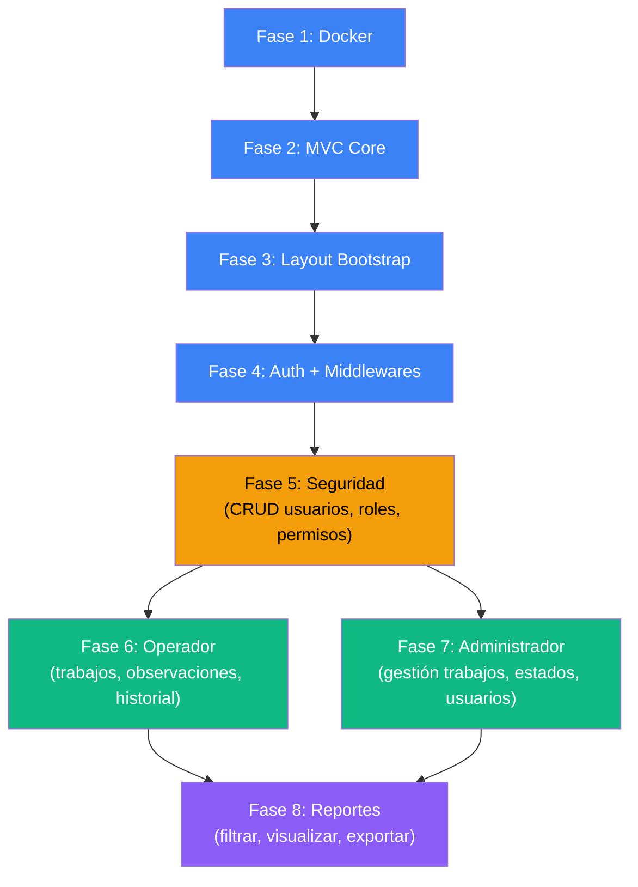

# Hoja de Ruta — Proyecto COSMOL Reportes

> Flujo completo de desarrollo, desde los cimientos hasta el sistema terminado.  
> Cada fase tendrá su propio **plan de implementación** en [`Docs/fabian/`](file:///c:/Proyectos/Cosmol_reportes/Docs/fabian).

---

## Vista General

El desarrollo se divide en **2 etapas** con **8 fases** en total:

```
 ETAPA A — Cimientos Técnicos              ETAPA B — Módulos Funcionales
 (transversal, ya documentada)              (vertical, por caso de uso)
┌─────────────────────────────┐     ┌─────────────────────────────────────────┐
│ Fase 1 │ Docker             │  │ Fase 5 │ Seguridad (completar)         │
│ Fase 2 │ MVC Core           │  │ Fase 6 │ Módulo Operador                      │
│ Fase 3 │ Layout Bootstrap   │  │ Fase 7 │ Módulo Administrador                 │
│ Fase 4 │ Auth + Middlewares │  │ Fase 8 │ Módulo Reportes                      │
└─────────────────────────────┘     └─────────────────────────────────────────┘
```

---

## Etapa A — Cimientos Técnicos (Fases 1–4) ✅

> **Estado:** ✅ **Completada y Realizada** (Implementada en código y documentada en [`Docs/fabian/realizado/implementacion_inicial.md`](file:///c:/Proyectos/Cosmol_reportes/Docs/fabian/realizado/implementacion_inicial.md)).

| Fase | Plan de Implementación | Qué entrega | Estado |
|---|---|---|---|
| **Fase 1** | Docker y Base de Datos | Contenedores Docker funcionando (`cosmol_app`, `cosmol_db`), BD PostgreSQL con esquema inicial, conexión pgAdmin 4 | ✅ Realizado |
| **Fase 2** | MVC Core | Mini-framework MVC: Router, Controller, Model, Database Singleton, front controller | ✅ Realizado |
| **Fase 3** | Layout Bootstrap | Dashboard con Bootstrap 5.3 + Icons: navbar, sidebar dinámico por rol, footer, responsive | ✅ Realizado |
| **Fase 4** | Auth + Middlewares | Login/logout, sesiones, AuthMiddleware, RoleMiddleware y RBAC | ✅ Realizado |

**Resultado de la Etapa A:** ✅ Sistema base operativo que arranca en Docker, autentica usuarios, maneja sesiones y controla acceso por roles.

---

## Etapa B — Módulos Funcionales (Fases 5–8) ✅

> **Estado:** ✅ **Completada y Realizada al 100%.** Todas las fases funcionales (Fase 5: Seguridad, Fase 6: Operador, Fase 7: Administrador y Fase 8: Reportes) han sido implementadas, verificadas y documentadas con éxito.

### Fase 5 — Módulo Seguridad (✅)

> Completa el control de acceso y administración de cuentas. El administrador gestiona usuarios, roles y permisos desde la interfaz con control RBAC.

| Caso de Uso | Controllers | Views | Models |
|---|---|---|---|
| Gestionar Usuario (CRUD) | `UsuarioController` | `seguridad/usuarios.php` | `Usuario.php` |
| Gestionar Rol (CRUD) | `RolController` | `seguridad/roles.php` | `Rol.php` |
| Asignar Permiso | `RolController` | `seguridad/permisos.php` | `Permiso.php` |

**Entregable:** El administrador puede crear, editar, cambiar estado de usuarios y gestionar roles/permisos desde el sistema.  
**Archivo de Resumen:** [`Docs/fabian/realizado/fase_5_seguridad_completado.md`](file:///c:/Proyectos/Cosmol_reportes/Docs/fabian/realizado/fase_5_seguridad_completado.md) *(✅ Realizado y validado)*

---

### Fase 6 — Módulo Operador (✅)

> El módulo operativo del sistema. Los operadores visualizan y concluyen sus trabajos pendientes consumiendo APIs REST externas (ver AGENTS.md §1.1). **El sistema NO almacena trabajos localmente.**

| Caso de Uso | Controllers | Views | Services / Models |
|---|---|---|---|
| Listar Trabajos por Especialidad | `OperadorController` | `operador/reconexiones.php`<br>`operador/reclamos.php` | `ApiClient.php` (cURL GET)<br>`Especialidad.php` |
| Visualizar Detalle de Trabajo | `OperadorController` | `operador/reconexion_detalle.php`<br>`operador/reclamo_detalle.php` | `ApiClient.php` (cURL GET)<br>GPS Google Maps + Fotos |
| Concluir Trabajo Asignado | `OperadorController` | Formulario en vista detalle | `ApiClient.php` (cURL PUT / POST) |

**Entregable:** Un operador inicia sesión, el sistema detecta su especialidad (Reconexión, Maestro de alcantarillado, Agua Potable), lista sus trabajos pendientes desde la API externa con optimización móvil, permite inspeccionar el detalle (con socio solicitante, ubicación, ruta GPS y foto en vivo) y enviar la conclusión al servidor externo.  
**Archivo de Resumen:** [`Docs/fabian/realizado/modulo_operador_completado.md`](file:///c:/Proyectos/Cosmol_reportes/Docs/fabian/realizado/modulo_operador_completado.md) *(✅ Realizado y validado)*

---

### Fase 7 — Módulo Administrador (✅)

> El administrador gestiona personal y supervisa en vivo los trabajos externos desde un panel centralizado con métricas dinámicas en el Dashboard.

| Caso de Uso | Controllers | Views | Models / Services |
|---|---|---|---|
| Gestionar Personal (Usuarios) | `UsuarioController` | `administrador/usuarios.php` | `Usuario.php`, `Rol.php`, `Especialidad.php` |
| Supervisar Trabajos Externos | `AdministradorController` | `administrador/trabajos.php` | `ApiClient.php` (APIs Reconexiones y Reclamos) |
| Ficha Supervisada de Trabajo | `AdministradorController` | `administrador/trabajo_detalle_*.php` | `ApiClient.php` (Solo lectura + GPS/Foto) |

**Entregable:** Panel administrativo con supervisión consolidada de reconexiones y reclamos externos, gestión de personal con especialidad y dashboard con métricas en tiempo real.  
**Archivo de Resumen:** [`Docs/fabian/realizado/fase_7_modulo_administrador_completado.md`](file:///c:/Proyectos/Cosmol_reportes/Docs/fabian/realizado/fase_7_modulo_administrador_completado.md) *(✅ Realizado y validado)*

---

### Fase 8 — Módulo Reportes (✅)

> Visualización, filtrado dinámico y exportación a CSV de las consultas registradas por el chatbot de COSMOL.

| Caso de Uso | Controllers | Views | Models |
|---|---|---|---|
| Visualizar y Filtrar Reporte | `ReporteController` | `reportes/visualizar.php` | `Reporte.php` |
| Exportar Reporte CSV | `ReporteController` | Generación stream CSV | `Reporte.php` |

**Entregable:** Interfaz con filtros combinados (fecha y tipo de consulta), tabla paginada con badges y exportación directa a CSV con soporte de caracteres especiales (BOM UTF-8) para Excel.  
**Archivo de Resumen:** [`Docs/fabian/realizado/fase_8_modulo_reportes_completado.md`](file:///c:/Proyectos/Cosmol_reportes/Docs/fabian/realizado/fase_8_modulo_reportes_completado.md) *(✅ Realizado y validado)*


---

## Diagrama de Dependencias



**Leyenda:**
- 🔵 Azul = Etapa A (Cimientos) — ya documentada
- 🟡 Amarillo = Seguridad — puente entre cimientos y módulos
- 🟢 Verde = Módulos funcionales principales
- 🟣 Morado = Reportes — depende de que existan datos de los otros módulos

---

## Flujo de Trabajo por Fase

Cada fase seguirá este ciclo:

```
  ┌─────────────────────────────────────────────────┐
  │  1. PLANIFICAR                                   │
  │     Crear plan en Docs/fabian/fase_N_nombre.md   │
  │     Revisar y aprobar antes de codificar         │
  ├─────────────────────────────────────────────────┤
  │  2. IMPLEMENTAR                                  │
  │     Ejecutar paso a paso según el plan           │
  │     Verificar cada paso antes de avanzar         │
  ├─────────────────────────────────────────────────┤
  │  3. VERIFICAR                                    │
  │     Cumplir el checklist final del plan          │
  │     Probar en el navegador y en pgAdmin4         │
  ├─────────────────────────────────────────────────┤
  │  4. SIGUIENTE FASE                               │
  │     Solo avanzar si la verificación pasa         │
  └─────────────────────────────────────────────────┘
```

---

## Complejidad Estimada por Fase

| Fase | Complejidad | Archivos nuevos aprox. | Notas |
|---|---|---|---|
| Fase 1 | 🟢 Baja | 5 | Configuración, no código de app |
| Fase 2 | 🟡 Media | 8 | Framework core, requiere cuidado en Router |
| Fase 3 | 🟢 Baja | 6 | Maquetación HTML/CSS con Bootstrap |
| Fase 4 | 🟡 Media | 6 | Autenticación, middlewares, seguridad |
| Fase 5 | 🟡 Media | 5-7 | CRUD completo + permisos |
| Fase 6 | 🟡 Media | 6-8 | Lógica de trabajos y estados |
| Fase 7 | 🟡 Media | 6-8 | Reutiliza lógica pero agrega gestión |
| Fase 8 | 🔴 Media-Alta | 5-7 | Filtros, visualización, exportación |

---

## Estructura de Planes en Docs/fabian/

```
Docs/fabian/
├── realizado/
│   ├── implementacion_inicial.md                  ← ✅ Etapa A completa (Fases 1–4)
│   ├── fase_5_seguridad_completado.md             ← ✅ Fase 5 completa (Seguridad)
│   ├── fase_6_modulo_operador_completado.md       ← ✅ Fase 6 completa (Operador)
│   ├── fase_7_modulo_administrador_completado.md  ← ✅ Fase 7 completa (Administrador)
│   └── fase_8_modulo_reportes_completado.md       ← ✅ Fase 8 completa (Reportes)
└── pendiente/                                     ← Detalle de los pasos ejecutados
```

---

## Estado Final del Proyecto

> [!NOTE]
> **Proyecto Base Concluido:** Todas las fases planificadas en el Roadmap (**Fases 1 a 8**, correspondientes a la **Etapa A** de cimientos y la **Etapa B** de módulos funcionales) han sido implementadas, integradas y validadas al 100%. El sistema cumple a cabalidad con la arquitectura y restricciones definidas en [`AGENTS.md`](file:///c:/Proyectos/Cosmol_reportes/AGENTS.md).


