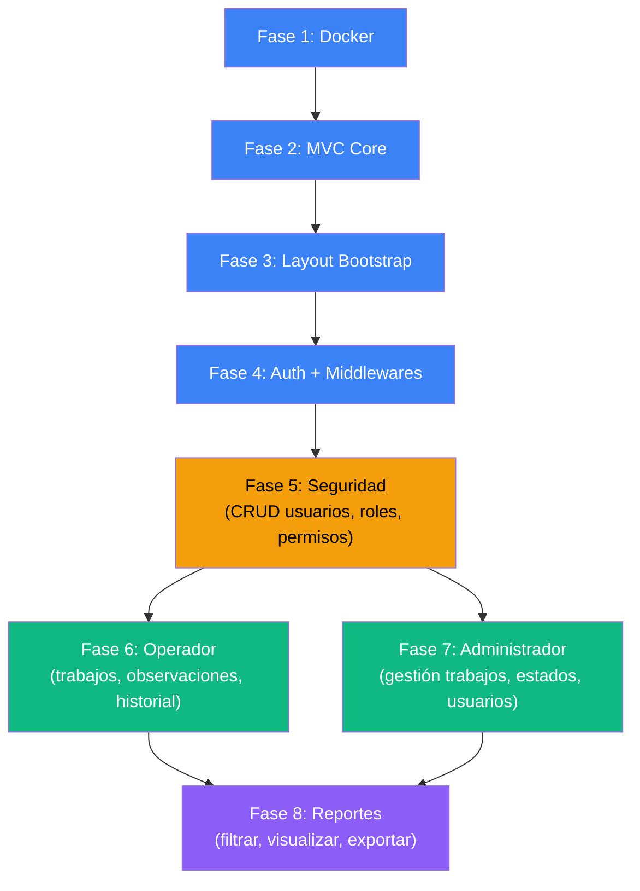

# Hoja de Ruta — Proyecto COSMOL Reportes

> Flujo completo de desarrollo, desde los cimientos hasta el sistema terminado.  
> Cada fase tendrá su propio **plan de implementación** en [`Docs/fabian/`](file:///c:/Proyectos/Cosmol_reportes/Docs/fabian).

---

## Vista General

El desarrollo se divide en **2 etapas** con **8 fases** en total:

```
 ETAPA A — Cimientos Técnicos              ETAPA B — Módulos Funcionales
 (transversal, ya documentada)              (vertical, por caso de uso)
┌─────────────────────────────┐     ┌─────────────────────────────────────────┐
│ Fase 1 │ Docker             │  │ Fase 5 │ Seguridad (completar)         │
│ Fase 2 │ MVC Core           │  │ Fase 6 │ Módulo Operador                      │
│ Fase 3 │ Layout Bootstrap   │  │ Fase 7 │ Módulo Administrador                 │
│ Fase 4 │ Auth + Middlewares │  │ Fase 8 │ Módulo Reportes                      │
└─────────────────────────────┘     └─────────────────────────────────────────┘
```

---

## Etapa A — Cimientos Técnicos (Fases 1–4) ✅

> **Estado:** ✅ **Completada y Realizada** (Implementada en código y documentada en [`Docs/fabian/realizado/implementacion_inicial.md`](file:///c:/Proyectos/Cosmol_reportes/Docs/fabian/realizado/implementacion_inicial.md)).

| Fase | Plan de Implementación | Qué entrega | Estado |
|---|---|---|---|
| **Fase 1** | Docker y Base de Datos | Contenedores Docker funcionando (`cosmol_app`, `cosmol_db`), BD PostgreSQL con esquema inicial, conexión pgAdmin 4 | ✅ Realizado |
| **Fase 2** | MVC Core | Mini-framework MVC: Router, Controller, Model, Database Singleton, front controller | ✅ Realizado |
| **Fase 3** | Layout Bootstrap | Dashboard con Bootstrap 5.3 + Icons: navbar, sidebar dinámico por rol, footer, responsive | ✅ Realizado |
| **Fase 4** | Auth + Middlewares | Login/logout, sesiones, AuthMiddleware, RoleMiddleware y RBAC | ✅ Realizado |

**Resultado de la Etapa A:** ✅ Sistema base operativo que arranca en Docker, autentica usuarios, maneja sesiones y controla acceso por roles.

---

## Etapa B — Módulos Funcionales (Fases 5–8)

> **Estado:** 🚀 **En curso.** Fase 5 (Seguridad) y Fase 6 (Módulo Operador) concluidas y validadas exitosamente al 100%.

### Fase 5 — Módulo Seguridad (✅)

> Completa el control de acceso y administración de cuentas. El administrador gestiona usuarios, roles y permisos desde la interfaz con control RBAC.

| Caso de Uso | Controllers | Views | Models |
|---|---|---|---|
| Gestionar Usuario (CRUD) | `UsuarioController` | `seguridad/usuarios.php` | `Usuario.php` |
| Gestionar Rol (CRUD) | `RolController` | `seguridad/roles.php` | `Rol.php` |
| Asignar Permiso | `RolController` | `seguridad/permisos.php` | `Permiso.php` |

**Entregable:** El administrador puede crear, editar, cambiar estado de usuarios y gestionar roles/permisos desde el sistema.  
**Archivo de Resumen:** [`Docs/fabian/realizado/fase_5_seguridad_completado.md`](file:///c:/Proyectos/Cosmol_reportes/Docs/fabian/realizado/fase_5_seguridad_completado.md) *(✅ Realizado y validado)*

---

### Fase 6 — Módulo Operador (✅)

> El módulo operativo del sistema. Los operadores visualizan y concluyen sus trabajos pendientes consumiendo APIs REST externas (ver AGENTS.md §1.1). **El sistema NO almacena trabajos localmente.**

| Caso de Uso | Controllers | Views | Services / Models |
|---|---|---|---|
| Listar Trabajos por Especialidad | `OperadorController` | `operador/reconexiones.php`<br>`operador/reclamos.php` | `ApiClient.php` (cURL GET)<br>`Especialidad.php` |
| Visualizar Detalle de Trabajo | `OperadorController` | `operador/reconexion_detalle.php`<br>`operador/reclamo_detalle.php` | `ApiClient.php` (cURL GET)<br>GPS Google Maps + Fotos |
| Concluir Trabajo Asignado | `OperadorController` | Formulario en vista detalle | `ApiClient.php` (cURL PUT / POST) |

**Entregable:** Un operador inicia sesión, el sistema detecta su especialidad (Reconexión, Maestro de alcantarillado, Agua Potable), lista sus trabajos pendientes desde la API externa con optimización móvil, permite inspeccionar el detalle (con socio solicitante, ubicación, ruta GPS y foto en vivo) y enviar la conclusión al servidor externo.  
**Archivo de Resumen:** [`Docs/fabian/realizado/modulo_operador_completado.md`](file:///c:/Proyectos/Cosmol_reportes/Docs/fabian/realizado/modulo_operador_completado.md) *(✅ Realizado y validado)*

---

### Fase 7 — Módulo Administrador

> El administrador gestiona trabajos, usuarios y estados desde un panel centralizado.

| Caso de Uso | Controllers | Views | Models |
|---|---|---|---|
| Gestionar Usuario | `AdministradorController` | `administrador/usuarios.php` | Reutiliza `Usuario.php` |
| Gestionar Trabajo | `AdministradorController` | `administrador/trabajos.php` | `Trabajo.php` |
| Registrar Trabajo Pendiente | `AdministradorController` | `administrador/trabajo_pendiente.php` | `Trabajo.php` |
| Gestionar Estado | `AdministradorController` | `administrador/estados.php` | `Estado.php` |

**Entregable:** El administrador crea trabajos pendientes, los asigna a operadores, gestiona estados y supervisa todo el sistema.  
**Archivo:** `Docs/fabian/fase_7_administrador.md` *(por crear)*

---

### Fase 8 — Módulo Reportes

> Visualización y exportación de datos de consultas de socios y trabajos.

| Caso de Uso | Controllers | Views | Models |
|---|---|---|---|
| Filtrar Reporte | `ReporteController` | `reportes/filtrar.php` | `Reporte.php` |
| Visualizar Reporte | `ReporteController` | `reportes/visualizar.php` | `Reporte.php` |
| Exportar Reporte | `ReporteController` | `reportes/exportar.php` | `Reporte.php` |

**Entregable:** Se pueden filtrar consultas por fecha/operador/estado, visualizar los resultados y exportarlos.  
**Archivo:** `Docs/fabian/fase_8_reportes.md` *(por crear)*

---

## Diagrama de Dependencias



**Leyenda:**
- 🔵 Azul = Etapa A (Cimientos) — ya documentada
- 🟡 Amarillo = Seguridad — puente entre cimientos y módulos
- 🟢 Verde = Módulos funcionales principales
- 🟣 Morado = Reportes — depende de que existan datos de los otros módulos

---

## Flujo de Trabajo por Fase

Cada fase seguirá este ciclo:

```
  ┌─────────────────────────────────────────────────┐
  │  1. PLANIFICAR                                   │
  │     Crear plan en Docs/fabian/fase_N_nombre.md   │
  │     Revisar y aprobar antes de codificar         │
  ├─────────────────────────────────────────────────┤
  │  2. IMPLEMENTAR                                  │
  │     Ejecutar paso a paso según el plan           │
  │     Verificar cada paso antes de avanzar         │
  ├─────────────────────────────────────────────────┤
  │  3. VERIFICAR                                    │
  │     Cumplir el checklist final del plan          │
  │     Probar en el navegador y en pgAdmin4         │
  ├─────────────────────────────────────────────────┤
  │  4. SIGUIENTE FASE                               │
  │     Solo avanzar si la verificación pasa         │
  └─────────────────────────────────────────────────┘
```

---

## Complejidad Estimada por Fase

| Fase | Complejidad | Archivos nuevos aprox. | Notas |
|---|---|---|---|
| Fase 1 | 🟢 Baja | 5 | Configuración, no código de app |
| Fase 2 | 🟡 Media | 8 | Framework core, requiere cuidado en Router |
| Fase 3 | 🟢 Baja | 6 | Maquetación HTML/CSS con Bootstrap |
| Fase 4 | 🟡 Media | 6 | Autenticación, middlewares, seguridad |
| Fase 5 | 🟡 Media | 5-7 | CRUD completo + permisos |
| Fase 6 | 🟡 Media | 6-8 | Lógica de trabajos y estados |
| Fase 7 | 🟡 Media | 6-8 | Reutiliza lógica pero agrega gestión |
| Fase 8 | 🔴 Media-Alta | 5-7 | Filtros, visualización, exportación |

---

## Estructura de Planes en Docs/fabian/

```
Docs/fabian/
├── realizado/
│   ├── implementacion_inicial.md          ← ✅ Etapa A completa (Fases 1–4)
│   ├── fase_5_seguridad_completado.md     ← ✅ Fase 5 completa (Seguridad)
│   └── modulo_operador_completado.md      ← ✅ Fase 6 completa (Operador)
├── fase_7_administrador.md                ← 📝 Por crear
└── fase_8_reportes.md                     ← 📝 Por crear
```

---

## ¿Cómo avanzamos?

> [!TIP]
> **Siguiente Paso Inmediato:** Con la **Fase 5 (Seguridad)** completada y el **Módulo Operador (Fase 6)** consolidado y validado en tiempo real con las APIs externas, el siguiente módulo a planificar e implementar es la **Fase 7: Módulo Administrador (`fase_7_administrador.md`)**.

